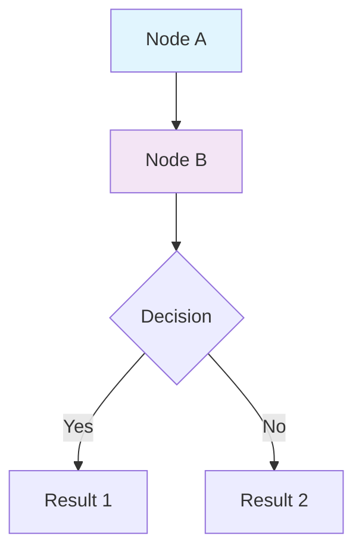

# System Architecture Documentation

## Overview

This directory contains the complete system architecture documentation for the ADS599 Capstone Soccer Intelligence System, including visual diagrams and detailed explanations of how all components work together.

## Files in This Directory

### `system_architecture_diagram.mmd`
- **Format**: Mermaid diagram source code
- **Purpose**: Visual representation of the complete system architecture
- **Layers**: User Interface, Application, Infrastructure, Data, and Configuration layers
- **Usage**: Can be rendered in GitHub, VS Code, or any Mermaid-compatible viewer

## How to View the Architecture Diagram

### Method 1: GitHub (Recommended)
1. Navigate to the file in GitHub
2. GitHub automatically renders Mermaid diagrams
3. View the interactive diagram with zoom and pan capabilities

### Method 2: VS Code with Mermaid Extension
1. Install the "Mermaid Preview" extension in VS Code
2. Open `system_architecture_diagram.mmd`
3. Use Ctrl+Shift+P → "Mermaid: Preview Diagram"

### Method 3: Online Mermaid Editor
1. Copy the contents of `system_architecture_diagram.mmd`
2. Go to https://mermaid.live/
3. Paste the code to see the rendered diagram

### Method 4: Command Line Rendering
```bash
# Install mermaid-cli
npm install -g @mermaid-js/mermaid-cli

# Render to PNG
mmdc -i system_architecture_diagram.mmd -o architecture.png

# Render to SVG
mmdc -i system_architecture_diagram.mmd -o architecture.svg
```

## Architecture Layers Explained

### User Interface Layer
- **CLI Tools**: Command-line interfaces for easy interaction
- **Direct Access**: Direct PostgreSQL connection for advanced users

### Application Layer
- **SQL Logger**: Automatic query logging and result formatting
- **Pre-built Queries**: Common analysis templates
- **Data Loaders**: JSON to PostgreSQL data pipeline

### Infrastructure Layer
- **Docker Compose**: Multi-service orchestration
- **PostgreSQL**: Performance-optimized database
- **Redis**: High-speed caching layer

### Data Layer
- **JSON Files**: Source data files (teams, players, statistics)
- **SQL Logs**: Query history and results

### Configuration Layer
- **Database Schema**: Table definitions and relationships
- **Docker Config**: Service definitions and resource allocation

## Component Relationships

The diagram shows how data flows through the system:

1. **User Input** → CLI Tools → Application Layer
2. **JSON Data** → Data Loaders → PostgreSQL Database
3. **SQL Queries** → Logger → Database → Results → Log Files
4. **Configuration** → Infrastructure → Application Services

## Key Features Visualized

### Performance Optimization
- Strategic database indexes
- Connection pooling
- Resource allocation
- Caching layers

### Data Integrity
- Foreign key relationships
- Automatic timestamps
- Transaction safety
- Error handling

### Developer Experience
- Automatic logging
- Pre-built queries
- Easy CLI interfaces
- Comprehensive documentation

## Updating the Diagram

To modify the architecture diagram:

1. Edit `system_architecture_diagram.mmd`
2. Use Mermaid syntax for nodes, connections, and styling
3. Test the diagram in a Mermaid viewer
4. Commit changes to version control

### Mermaid Syntax Reference



## Related Documentation

- **System Architecture Methodology**: `../../SYSTEM_ARCHITECTURE_METHODOLOGY.md`
- **SQL Playground Guide**: `../../SQL_PLAYGROUND_GUIDE.md`
- **Database Schema**: `../../docker/postgres/init.sql`
- **Docker Configuration**: `../../docker-compose.yml`

## Architecture Benefits

### Scalability
- Container-based architecture
- Horizontal scaling capabilities
- Modular component design

### Performance
- Optimized database configuration
- Strategic indexing
- Caching layers
- Resource allocation

### Maintainability
- Clear separation of concerns
- Documented interfaces
- Automated logging
- Configuration-driven setup

### Developer Productivity
- Simple CLI interfaces
- Automatic result logging
- Pre-built analysis queries
- Comprehensive documentation

This architecture enables rapid development and deployment of high-performance database systems with comprehensive logging, analysis, and visualization capabilities.
