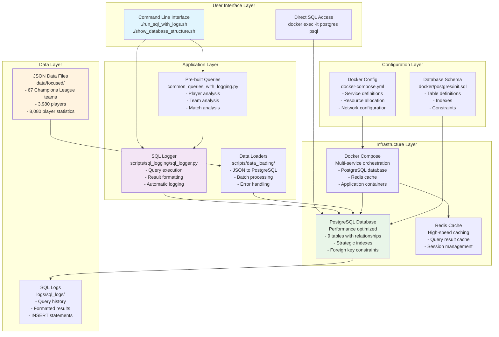

# System Architecture Diagram

This document contains the visual representation of the ADS599 Capstone Soccer Intelligence System architecture.

## Architecture Overview

The system is built with a layered architecture approach, consisting of 5 main layers that work together to provide a comprehensive soccer intelligence platform.

## Visual Architecture Diagram

## Layer Descriptions

### User Interface Layer
- **CLI Tools**: Command-line interfaces for easy system interaction
- **Direct Access**: Direct PostgreSQL connection for advanced database operations

### Application Layer
- **SQL Logger**: Automatic query logging with result formatting
- **Pre-built Queries**: Common analysis templates for quick insights
- **Data Loaders**: Efficient JSON to PostgreSQL data pipeline

### Infrastructure Layer
- **Docker Compose**: Multi-service orchestration and management
- **PostgreSQL**: High-performance database with optimized configuration
- **Redis**: High-speed caching layer for improved performance

### Data Layer
- **JSON Files**: Source data containing teams, players, and statistics
- **SQL Logs**: Query history and formatted results for analysis tracking

### Configuration Layer
- **Database Schema**: Table definitions, indexes, and constraints
- **Docker Config**: Service definitions and resource allocation

## Data Flow

1. **User Input** → CLI Tools → Application Layer
2. **JSON Data** → Data Loaders → PostgreSQL Database
3. **SQL Queries** → Logger → Database → Results → Log Files
4. **Configuration** → Infrastructure → Application Services

## Key Features

- **Performance Optimization**: Strategic indexing, caching, and resource allocation
- **Data Integrity**: Foreign key relationships and transaction safety
- **Developer Experience**: Automatic logging and pre-built analysis tools
- **Scalability**: Container-based architecture for easy scaling

## Related Files

- **Raw Mermaid File**: `system_architecture_diagram.mmd`
- **System Methodology**: `../../SYSTEM_ARCHITECTURE_METHODOLOGY.md`
- **SQL Guide**: `../../SQL_PLAYGROUND_GUIDE.md`
- **Docker Configuration**: `../../docker-compose.yml`
