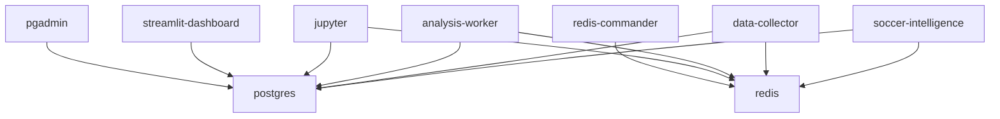

# Docker Deployment Guide for ADS599 Capstone Soccer Intelligence System

This comprehensive guide covers the Docker containerization solution for the Soccer Intelligence System, including deployment, configuration, and workflow execution.

## Table of Contents

1. [Overview](#overview)
2. [Prerequisites](#prerequisites)
3. [Quick Start](#quick-start)
4. [Environment Configuration](#environment-configuration)
5. [Build and Deployment](#build-and-deployment)
6. [Service Architecture](#service-architecture)
7. [Data Persistence](#data-persistence)
8. [Workflow Execution](#workflow-execution)
9. [Monitoring and Troubleshooting](#monitoring-and-troubleshooting)
10. [Performance Optimization](#performance-optimization)

## Overview

The Docker containerization solution provides:

- **Multi-stage Dockerfile** optimized for production and development
- **Docker Compose orchestration** with database and caching services
- **Secure environment management** for API keys and credentials
- **Optimized performance** for data collection and Shapley analysis
- **Scalable architecture** with worker containers
- **Comprehensive monitoring** and health checks

### Key Features

- ✅ **67 UEFA Champions League teams** dataset compatibility
- ✅ **Multi-season analysis** (2019-2024) support
- ✅ **Shapley value analysis** optimization
- ✅ **API rate limiting** and caching
- ✅ **Data persistence** with volume mounts
- ✅ **Development tools** (Jupyter, Streamlit, FastAPI)
- ✅ **Database integration** (PostgreSQL, Redis)
- ✅ **Performance monitoring** and optimization

## Prerequisites

### System Requirements

- **Docker**: Version 20.10+ 
- **Docker Compose**: Version 2.0+
- **System Memory**: Minimum 8GB RAM (16GB recommended)
- **Disk Space**: Minimum 20GB free space
- **CPU**: Multi-core processor (4+ cores recommended)

### API Keys Required

- **API-Football**: Get from [dashboard.api-football.com](https://dashboard.api-football.com)
- **OpenAI**: Get from [platform.openai.com](https://platform.openai.com/api-keys)
- **Twitter** (Optional): Get from [developer.twitter.com](https://developer.twitter.com)

## Quick Start

### 1. Clone and Setup

```bash
# Clone the repository
git clone https://github.com/mmoramora/ADS599_Capstone.git
cd ADS599_Capstone

# Copy environment template
cp .env.template .env

# Edit environment variables
nano .env  # Add your API keys
```

### 2. Configure Environment

```bash
# Copy API keys template
cp config/api_keys_template.yaml config/api_keys.yaml

# Edit API keys file
nano config/api_keys.yaml  # Add your actual API keys
```

### 3. Build and Start Services

```bash
# Build and start all services
docker-compose up -d

# Check service status
docker-compose ps

# View logs
docker-compose logs -f soccer-intelligence
```

### 4. Run Quick Validation

```bash
# Run quick validation workflow
./docker/scripts/run-workflows.sh quick

# Or run directly with Docker Compose
docker-compose run --rm soccer-intelligence python scripts/analysis/player_statistics_validator.py
```

## Environment Configuration

### Environment Variables (.env file)

```bash
# API Keys
API_FOOTBALL_KEY=your_api_football_key_here
OPENAI_API_KEY=your_openai_api_key_here
TWITTER_BEARER_TOKEN=your_twitter_bearer_token_here

# Database Configuration
POSTGRES_DB=soccer_intelligence
POSTGRES_USER=soccerapp
POSTGRES_PASSWORD=soccerpass123

# Redis Configuration
REDIS_PASSWORD=redispass123

# Application Settings
ENVIRONMENT=production
LOG_LEVEL=INFO
MAX_API_REQUESTS_PER_MINUTE=100
CACHE_ENABLED=true

# Performance Settings
MEMORY_LIMIT=6g
CPU_LIMIT=4
WORKER_PROCESSES=2
CACHE_SIZE=1g
```

### API Keys Configuration (config/api_keys.yaml)

```yaml
# API-Football Configuration
api_football:
  key: "your_api_football_key_here"

# OpenAI Configuration  
openai:
  api_key: "your_openai_api_key_here"

# Twitter API Configuration (Optional)
twitter:
  bearer_token: "your_twitter_bearer_token_here"

# SportMonks API Configuration (Alternative)
sportmonks:
  api_key: "your_sportmonks_api_key_here"
```

## Build and Deployment

### Production Deployment

```bash
# Build production image
docker-compose build --target production

# Start production services
docker-compose up -d soccer-intelligence postgres redis

# Scale workers if needed
docker-compose up -d --scale data-collector=3 --scale analysis-worker=2
```

### Development Deployment

```bash
# Start development environment
docker-compose --profile development up -d

# Access development services
# Jupyter: http://localhost:8888
# Streamlit: http://localhost:8501
# FastAPI: http://localhost:8000
# pgAdmin: http://localhost:8080
```

### Custom Build Options

```bash
# Build specific target
docker build --target development -t soccer-intelligence:dev .

# Build with custom arguments
docker build --build-arg PYTHON_VERSION=3.11 -t soccer-intelligence:custom .

# Multi-platform build
docker buildx build --platform linux/amd64,linux/arm64 -t soccer-intelligence:multi .
```

## Service Architecture

### Core Services

1. **soccer-intelligence**: Main application container
2. **postgres**: PostgreSQL database for structured data
3. **redis**: Redis cache for session management
4. **data-collector**: Scalable data collection workers
5. **analysis-worker**: Scalable analysis workers

### Development Services

1. **jupyter**: Jupyter Lab for interactive development
2. **streamlit-dashboard**: Data visualization dashboard
3. **fastapi-service**: REST API service
4. **pgadmin**: Database administration
5. **redis-commander**: Cache management

### Monitoring Services

1. **prometheus**: Metrics collection
2. **grafana**: Metrics visualization

### Service Dependencies



## Data Persistence

### Volume Mapping

The system uses persistent volumes for data storage:

```yaml
volumes:
  # Application data
  - ./data/focused:/app/data/focused          # UEFA Champions League data
  - ./data/cache:/app/data/cache              # API response cache
  - ./data/analysis:/app/data/analysis        # Analysis results
  - ./data/reports:/app/data/reports          # Generated reports
  - ./logs:/app/logs                          # Application logs
  
  # Configuration
  - ./config/api_keys.yaml:/app/config/api_keys.yaml:ro
  - ./config/team_statistics_collection_config.yaml:/app/config/team_statistics_collection_config.yaml:ro
  
  # Database data
  - postgres_data:/var/lib/postgresql/data    # PostgreSQL data
  - redis_data:/data                          # Redis data
```

### Data Directory Structure

```
data/
├── focused/
│   ├── players/           # Player statistics by team/season
│   │   ├── team_rosters/  # Team roster files
│   │   └── individual_stats/ # Individual player statistics
│   └── teams/             # Team statistics by season
├── cache/                 # API response cache
├── analysis/              # Analysis results and reports
├── reports/               # Generated validation reports
└── models/                # Trained models and artifacts
```

### Backup and Restore

```bash
# Backup data volumes
docker run --rm -v soccer-intelligence-postgres-data:/data -v $(pwd):/backup alpine tar czf /backup/postgres-backup.tar.gz /data

# Restore data volumes
docker run --rm -v soccer-intelligence-postgres-data:/data -v $(pwd):/backup alpine tar xzf /backup/postgres-backup.tar.gz -C /

# Backup application data
tar czf soccer-data-backup.tar.gz data/ logs/

# Restore application data
tar xzf soccer-data-backup.tar.gz
```

## Workflow Execution

### Available Workflows

Use the workflow execution script for orchestrated operations:

```bash
# Complete workflow (data collection + analysis)
./docker/scripts/run-workflows.sh full

# Quick validation workflow
./docker/scripts/run-workflows.sh quick

# Data collection only
./docker/scripts/run-workflows.sh collection

# Analysis only
./docker/scripts/run-workflows.sh analysis

# Validation only
./docker/scripts/run-workflows.sh validation

# Parallel execution
./docker/scripts/run-workflows.sh parallel
```

### Individual Workflow Components

```bash
# Player data collection
./docker/scripts/run-workflows.sh player-collection

# Team data collection
./docker/scripts/run-workflows.sh team-collection

# Shapley value analysis
./docker/scripts/run-workflows.sh shapley

# Multi-season comparative analysis
./docker/scripts/run-workflows.sh multi-season
```

### Custom Workflow Parameters

```bash
# Set environment variables for custom execution
export MAX_TEAMS=20
export SEASONS="2022,2023,2024"
export PARALLEL_WORKERS=4

# Run workflow with custom parameters
./docker/scripts/run-workflows.sh full
```

### Direct Container Execution

```bash
# Run specific scripts directly
docker-compose run --rm soccer-intelligence python scripts/data_collection/comprehensive_player_collection.py --mode full

# Interactive shell access
docker-compose run --rm soccer-intelligence bash

# Run with custom environment
docker-compose run --rm -e LOG_LEVEL=DEBUG soccer-intelligence python scripts/analysis/simple_shapley_analysis.py
```

## Monitoring and Troubleshooting

### Health Checks

```bash
# Check service health
docker-compose ps

# View service logs
docker-compose logs soccer-intelligence
docker-compose logs postgres
docker-compose logs redis

# Follow logs in real-time
docker-compose logs -f --tail=100 soccer-intelligence
```

### Performance Monitoring

```bash
# Monitor resource usage
docker stats

# Check container performance
docker-compose exec soccer-intelligence python scripts/monitor-performance.py

# View performance logs
docker-compose exec soccer-intelligence tail -f logs/performance.log
```

### Common Issues and Solutions

#### 1. API Rate Limiting

```bash
# Check API usage logs
docker-compose logs soccer-intelligence | grep "rate limit"

# Adjust rate limiting in environment
export MAX_API_REQUESTS_PER_MINUTE=50
docker-compose restart soccer-intelligence
```

#### 2. Memory Issues

```bash
# Check memory usage
docker stats soccer-intelligence

# Increase memory limit
export MEMORY_LIMIT=8g
docker-compose up -d soccer-intelligence
```

#### 3. Database Connection Issues

```bash
# Check database connectivity
docker-compose exec soccer-intelligence python -c "
import psycopg2
import os
conn = psycopg2.connect(
    host=os.environ.get('POSTGRES_HOST', 'postgres'),
    database=os.environ.get('POSTGRES_DB', 'soccer_intelligence'),
    user=os.environ.get('POSTGRES_USER', 'soccerapp'),
    password=os.environ.get('POSTGRES_PASSWORD', 'soccerpass123')
)
print('Database connection successful')
"

# Restart database service
docker-compose restart postgres
```

#### 4. Cache Issues

```bash
# Check Redis connectivity
docker-compose exec redis redis-cli ping

# Clear cache if needed
docker-compose exec redis redis-cli FLUSHALL

# Restart Redis service
docker-compose restart redis
```

### Debugging Commands

```bash
# Access container shell
docker-compose exec soccer-intelligence bash

# Check Python environment
docker-compose exec soccer-intelligence python -c "
import sys
print('Python version:', sys.version)
print('Python path:', sys.path)
"

# Validate configuration
docker-compose exec soccer-intelligence python -c "
import sys
sys.path.append('src')
from soccer_intelligence.utils.config import Config
config = Config()
print('Configuration loaded successfully')
"

# Test API connectivity
docker-compose exec soccer-intelligence python -c "
import sys
sys.path.append('src')
from soccer_intelligence.data_collection.api_football import APIFootballClient
client = APIFootballClient()
print('API client initialized successfully')
"
```

## Performance Optimization

### Container Resource Optimization

```bash
# Run optimization script
./docker/scripts/optimize-container.sh

# Apply resource limits
docker-compose up -d --scale soccer-intelligence=1 --memory=6g --cpus=4
```

### Database Performance Tuning

```bash
# Apply PostgreSQL optimizations
docker-compose exec postgres psql -U soccerapp -d soccer_intelligence -f /tmp/postgresql-optimization.conf

# Monitor database performance
docker-compose exec postgres psql -U soccerapp -d soccer_intelligence -c "
SELECT query, calls, total_time, mean_time
FROM pg_stat_statements
ORDER BY total_time DESC
LIMIT 10;
"
```

### Cache Optimization

```bash
# Apply Redis optimizations
docker-compose exec redis redis-cli CONFIG SET maxmemory 1gb
docker-compose exec redis redis-cli CONFIG SET maxmemory-policy allkeys-lru

# Monitor cache performance
docker-compose exec redis redis-cli INFO memory
```

### Parallel Processing

```bash
# Scale data collection workers
docker-compose up -d --scale data-collector=4

# Scale analysis workers
docker-compose up -d --scale analysis-worker=3

# Monitor worker performance
docker-compose logs -f data-collector analysis-worker
```

## Security Considerations

### Environment Security

- Store sensitive data in `.env` file (never commit to version control)
- Use Docker secrets for production deployments
- Implement proper network isolation
- Regular security updates for base images

### Network Security

```bash
# Create isolated network
docker network create --driver bridge soccer-intelligence-secure

# Run with custom network
docker-compose -f docker-compose.yml -f docker-compose.secure.yml up -d
```

### Access Control

```bash
# Run containers as non-root user
docker-compose exec soccer-intelligence whoami  # Should show 'soccerapp'

# Check file permissions
docker-compose exec soccer-intelligence ls -la /app/data/
```

## Production Deployment

### Production Configuration

```bash
# Use production environment
export ENVIRONMENT=production
export LOG_LEVEL=INFO
export DEBUG=false

# Start production services
docker-compose -f docker-compose.yml -f docker-compose.prod.yml up -d
```

### SSL/TLS Configuration

```bash
# Configure SSL certificates
export SSL_ENABLED=true
export SSL_CERT_PATH=/path/to/ssl/cert.pem
export SSL_KEY_PATH=/path/to/ssl/key.pem

# Start with SSL
docker-compose up -d
```

### Backup Strategy

```bash
# Automated backup script
#!/bin/bash
DATE=$(date +%Y%m%d_%H%M%S)
docker-compose exec postgres pg_dump -U soccerapp soccer_intelligence > backup_${DATE}.sql
tar czf data_backup_${DATE}.tar.gz data/ logs/
```

## Conclusion

This Docker containerization solution provides a robust, scalable, and maintainable deployment for the ADS599 Capstone Soccer Intelligence System. It supports the complete data processing pipeline from collection through Shapley analysis while maintaining compatibility with the existing 67 UEFA Champions League teams dataset structure.

For additional support or questions, refer to the project documentation or contact the development team.
